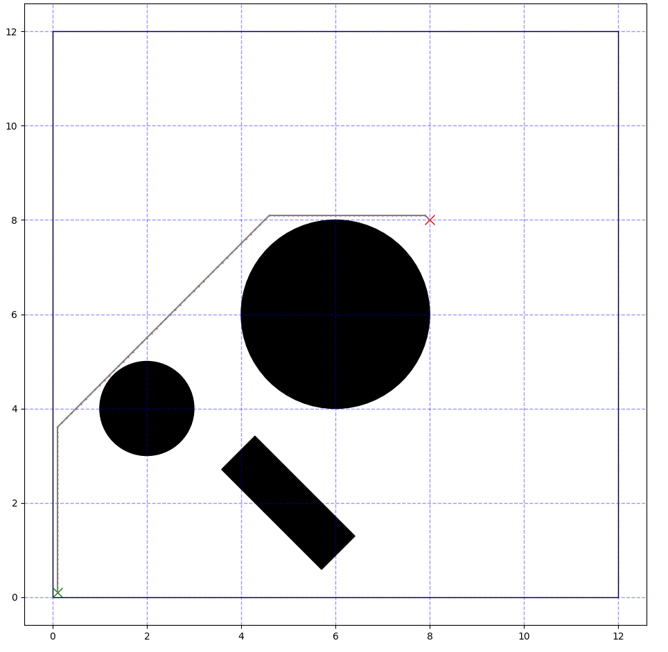
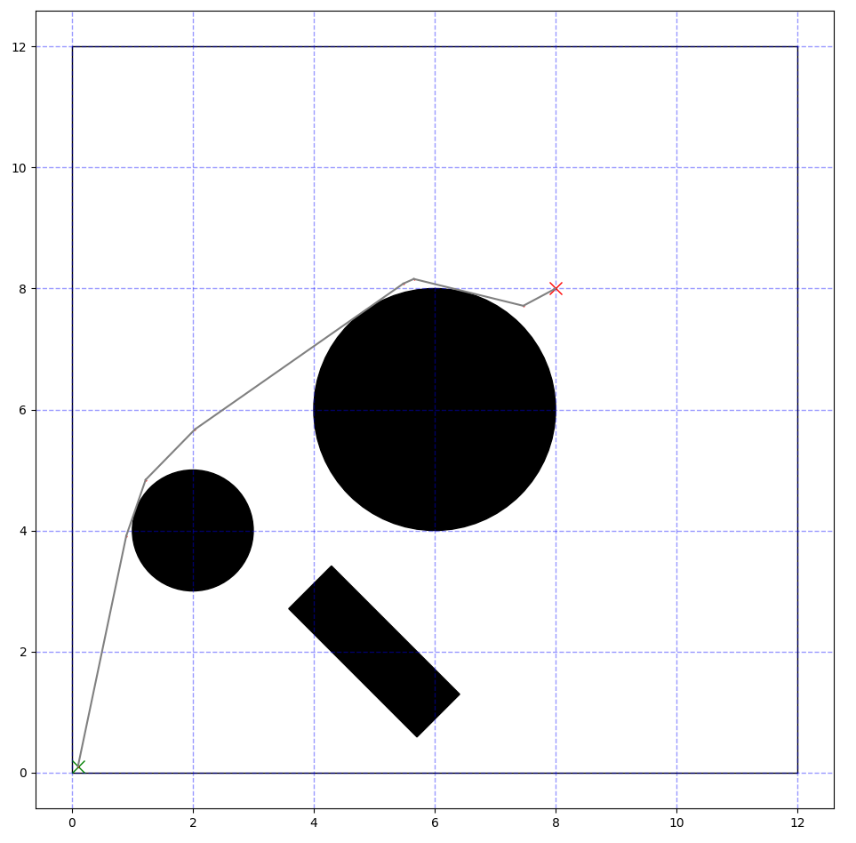
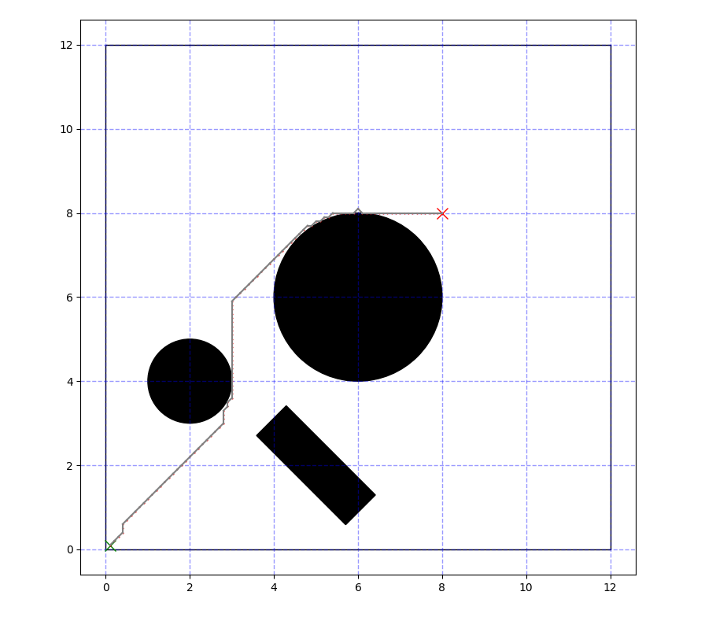
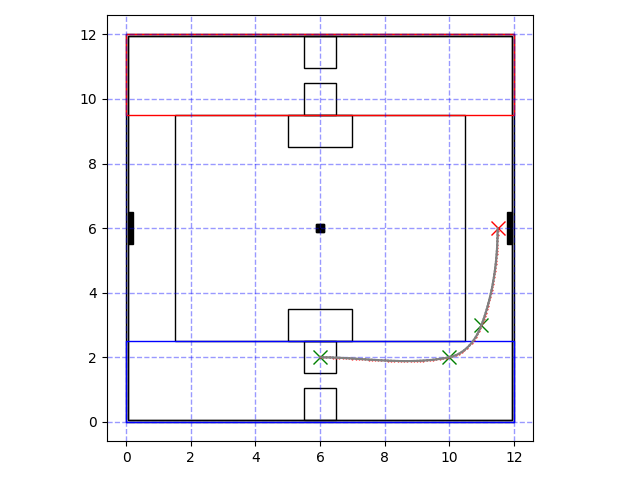

# TrajectryGeneration

Pythonによる経路生成ライブラリ

## Algorithms
実装済みのアルゴリズム 

### ・A*

### ・RRT/RRT*

### ・Monte-Carlo MPC

### ・Dijkstra

### ・DWA

(注意) バグが残っている可能性有り。

### ・Clothoid Interpolation

クロソイド補間。ローカルパス向け。

## Object
フィールドや機体などの図形オブジェクトについては、長方形と円のみ実装。
